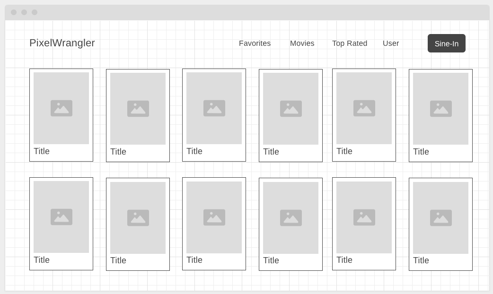
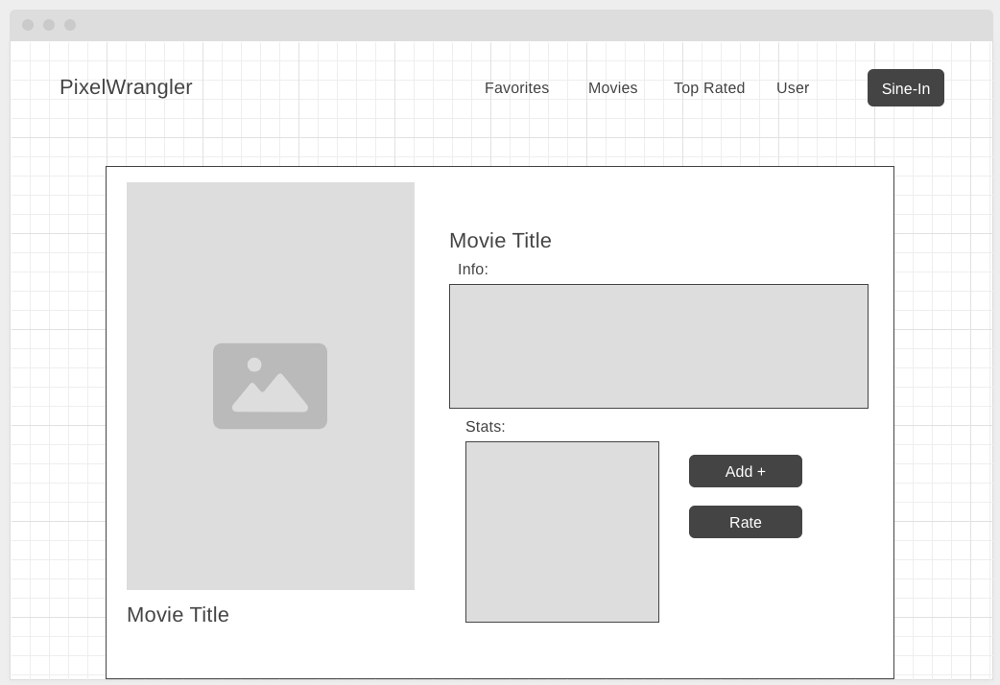
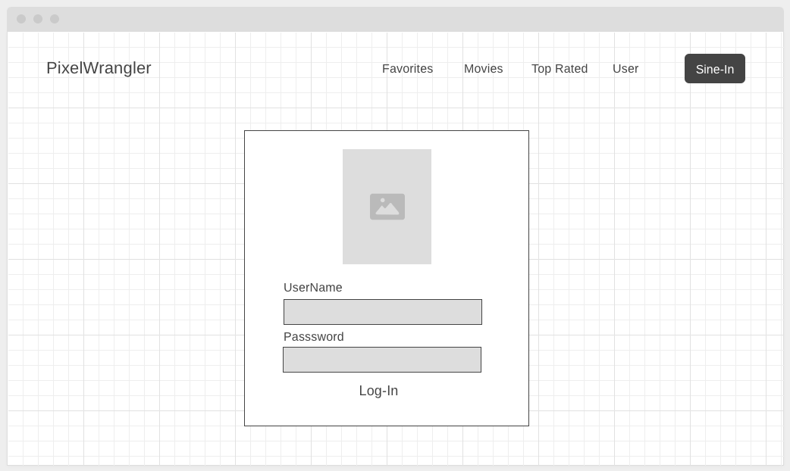

# PixelWrangler
---

## Padlet 
[Things we should maybe do](https://padlet.com/dasagi1467/pixel-wrangler-qm7c8xmzm2zpgymn)

---

### **Project Proposal: Movie Recommender Site**

#### **Purpose**
This Movie Recommender site will provide personalized movie recommendations based on user preferences, viewing history, and ratings. The plan is to create something simple for all users focausing on looking great and working great.

#### **Audience**
The primary audience is movie enthusiasts/ small brain people who enjoy finding good movies. Our secondary audience includes casual viewers seeking recommendations for popular movies, new releases, or hidden gems based on personalized suggestions.

#### **Data Sources**
The project will use a combination of:
1. **External API** - A third-party movie database API will provide movie information, such as titles, genres, descriptions, posters, and ratings.

2. **localStorage** - User preferences, such as favorite genres and watch history, could be stored locally to provide quick access and a more personalized experience without needing to log in each time.

3. **Local JSON File** - A JSON file containing genre details or preset recommendation data can provide quick access for offline testing or fallback data if the API call fails. Or to save a favorites list for a user. 

#### **External API**
We plan to use **OMDb API, IMDb API, TasteDive API, Watchmode API, JustWatch API, Trakt API, Netflix Roulette API, Utelly API** for our movie information, genres, trending titles, and rateings.

#### **Initial Components List**
1. **Authentication Component** - User login and registration, handling preferences and saved recommendations.
2. **Movie Search & Browse Component** - Allows users to search for movies and filter by genre, release year, etc.
3. **Recommendations Component** - Provides personalized movie suggestions based on user ratings, viewing history, and genre preferences.
4. **User Profile Component** - Allows users to view and edit their saved preferences, watched movies, and recommended films.
5. **Favorite Component** - Users can save movies they want to watch later.
6. **Rating Component** - Users can rate movies, which will inform their personalized recommendations.

#### **Wireframes for Each View of the Application**
- **Home Page & Favorites Page**

- **Movie Details Page**

- **Log-In Page**

#### **Colors/Typography/Specific Element Styling**
- **Color Scheme** - All white background with all text and elements black. Maybe some deep blues pops of color for action buttons.
- **Typography** - Clean, modern fonts such as *Roboto* or *Montserrat* for readability.
- **Specific Element Styling**:
  - Buttons with rounded corners and a slight shadow.
  - Movie posters in a grid layout with hover effects.
  - A sleek, minimalistic navigation bar at the top.

#### **Schedule & Milestones**
- **Week 1** - Complete the project proposal, finalize wireframes, and set up initial project structure with Svelte.
- **Week 2** - Set up the API integration, design homepage, and implement the search functionality.
- **Week 3** - Build the User Profile, Favorites, and Recommendations Component, and set up localStorage for preferences.
- **Week 4** - Implement rating and preference-based recommendations, final styling and testing, and any adjustments based on feedback.

---

